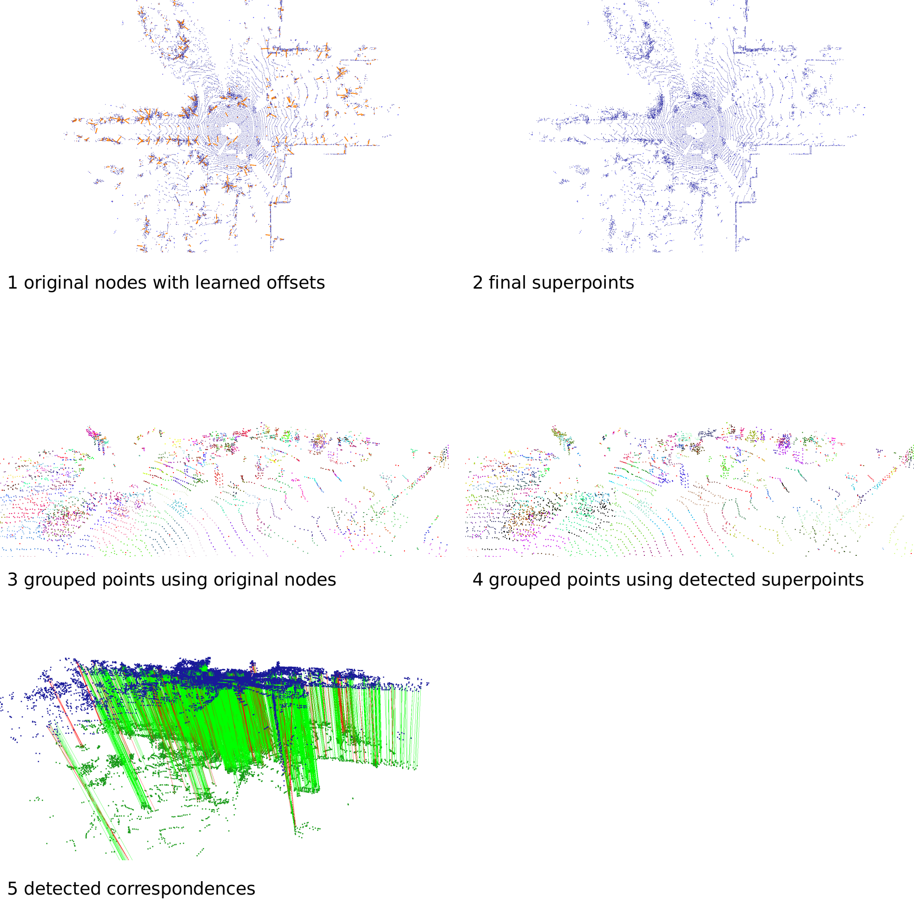
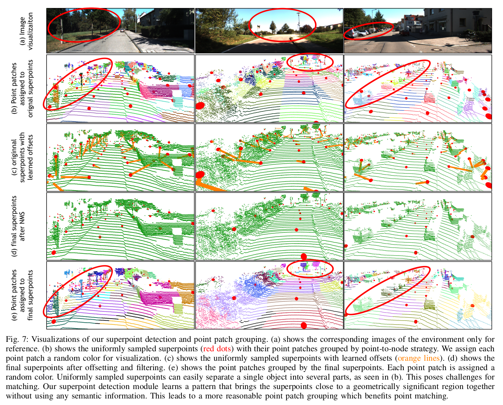

# RDMNet: Reliable Dense-point Matching for Robust and Accurate Point Cloud Registration
Official implementation of the paper:

[RDMNet: Reliable Dense-point Matching for Robust and Accurate Point Cloud Registration](https://arxiv.org/pdf/2303.18084.pdf).


## Installation

```
python setup.py develop
```

The code has been tested with Ubuntu 20.04, torch 1.8.0, cuda 11.4, and python 3.8.8


## Quick demo

```
python infer.py
```

This script returns correspondences between two scans and calculates relative pose.


## Preparation

Change `_C.output_dir` in `experiments/config.py` to your preferred path. Logs, trained snapshots, processed features will be saved in this path.

### Dataset (KITTI)

Download the data from the [Kitti official website](http://www.cvlibs.net/datasets/kitti/eval_odometry.php). 

```text
--(your dataset path)--Kitti--sequences--00--velodyne--000000.bin
                           |              |         |--...
                           |              |...
                           |--calib--sequences--00--calib.txt
                                             |   |--times.txt
                                             |--...

```

Change `_C.data.dataset_root` in `experiments/config.py` to your dataset path

### Downsample

Downsample the point cloud:

```
python preprocess/downsample_pcd_kitti.py
```

### Generate ground truth pairs

Generate ground truth pairs for testing:

```
python preprocess/generate_kitti_pairs.py
```

In `preprocess/generate_kitti_pairs.py`, we follow [FCGF](https://github.com/chrischoy/FCGF), [PREDATOR](https://github.com/prs-eth/OverlapPredator), [CoFiNet](https://github.com/haoyu94/Coarse-to-fine-correspondences), [SuperGlue](https://github.com/magicleap/SuperGluePretrainedNetwork), and [GeoTransformer](https://github.com/qinzheng93/GeoTransformer) to refine the ground truth relative poses using ICP. However, we find a same issue occurred in these repos. For more details, please refer to this [link](./issue.md).


## Training

```
python experiments/trainval.py
```

Using following command for multi-gpu training:

```
CUDA_VISIBLE_DEVICES=0,1,2,3 python -m torch.distributed.launch --nproc_per_node=4 experiments/trainval.py
```


## Testing

```
./eval.sh
```

For visualization, please set `_C.test.vis` to 'True'. You will get: original nodes with learned offsets, final superpoints, grouped points using orignial nodes, grouped points using detected superpoints, and detected correspondences in order.



Zooming in the grouped points, you will find that using the detected superpoints leads to the points of a single object are more easily to be grouped as a whole. See following demonstrations for closer examination.  Feel free to try you interested scans! 




## Results

| Datasets  | RR    | RRE(°) | RTE(cm) |
| --------- | ----- | ------ | ------- |
| KITTI     | 99.82 | 0.18   | 5.3     |
| KITTI-360 | 99.89 | 0.25   | 7.0     |
| Apollo    | 100   | 0.10   | 4.6     |
| Mulran    | 87.09 | 0.45   | 14.4    |

All results are evaluated using the same model trained on KITTI. Mulran poses significant challenge for generalization, as it loses approximated 70° field-of-view.


## Citation

```bibtex
@article{shi2023RDMNet,
  title={RDMNet: Reliable Dense Matching Based Point Cloud Registration for Autonomous Driving},
  author={Chenghao Shi and Xieyuanli Chen and Huimin Lu and Wenbang Deng and Junhao Xiao and Bin Dai},
  journal=IEEE Trans.~on Intelligent Transportation Systems (ITS)} ,
  year={2023}
}
```


## Acknowledgements

 We thank the following authors for open sourcing their methods.

- [D3Feat](https://github.com/XuyangBai/D3Feat.pytorch)
- [PREDATOR](https://github.com/prs-eth/OverlapPredator)
- [CoFiNet](https://github.com/haoyu94/Coarse-to-fine-correspondences)
- [SuperGlue](https://github.com/magicleap/SuperGluePretrainedNetwork)
- [GeoTransformer](https://github.com/qinzheng93/GeoTransformer)


## @todo

- [x] Add quick demo.
- [ ] Current codes have supported Mulran, KITTI360, and Apollo. Add tips for these datasets.

